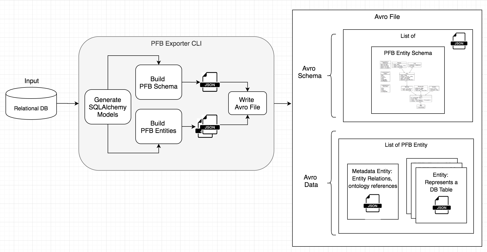

<p align="center">
  
</p>
<p align="center">
  <a href="https://circleci.com/gh/d3b-center/d3b-lib-pfb-exporter"><a>
  <a href="https://github.com/d3b-center/d3b-lib-pfb-exporter/blob/master/LICENSE"></a>
</p>

# 🏭 PFB Exporter

Transform and export data from a relational database into a
PFB (Portable Format for Bioinformatics) file.

A PFB file is special kind of Avro file, suitable for capturing and
reconstructing relational data. Read [Background](#Background) for more information.

**NOTE: This is still a 🚧 prototype as its only been tested on the Kids First
PostgreSQL database**

## Quickstart

```shell
$ git clone git@github.com:d3b-center/d3b-lib-pfb-exporter.git
$ cd d3b-lib-pfb-exporter
$ python3 -m venv venv
$ source venv/bin/activate
$ pip install -e .
$ pfbe -h
```

Try it out:

```shell
# List commands and docs
$ pfbe --help

# Create a PFB file from the given data and SQLAlchemy models
$ pfbe export tests/data/input -m tests/data/models.py -o tests/data/pfb_export

# Create a PFB file from the given data and generate SQLAlchemy models from db
$ pfbe export tests/data/input -d $MY_DB_CONN_URL -m tests/data/models.py -o tests/data/pfb_export

# Create just the PFB schema from the given SQLAlchemy models
$ pfbe create_schema -m tests/data/models.py -o tests/data/pfb_export

# Create just the PFB schema but first generate the SQLAlchemy models from db
$ pfbe create_schema -d $MY_DB_CONN_URL -m tests/data/models.py -o tests/data/pfb_export
```
## Outputs

The output contains the generated PFB file, logs, and other files for debugging

```
tests/data/pfb_export
├── logs
│   └── pfb_export.log  -> Log file containing log statements from console
├── metadata.json       -> PFB Metadata Entity
├── models.py           -> Generated SQLAlchemy model classes if run with -d CLI option
├── orm_models.json     -> Serialized SQLAlchemy model classes
├── pfb.avro            -> The PFB file
└── pfb_schema.json     -> The PFB file schema
```

## Supported Databases
Theoretically, any of the databases supported by SQLAlchemy but this
has only been tested on a single PostgreSQL database.

## Developers

Follow Quickstart instructions first. Then install dev requirements:

```shell
$ pip install -r dev-requirements.txt
```

# Background

## What is an Avro File?
A file with data records (JSON) and a schema (JSON) to describe each data
record. Avro files can be serialized into a binary format and compressed.

Read more about [Avro](https://Avro.apache.org/docs/current/spec.html).

## What is a PFB File?

A PFB file is special kind of Avro file, suitable for capturing and
reconstructing biomedical relational data.

A PFB file is an Avro file with a particular Avro schema that represents a
relational database. We call this schema the
[PFB Schema](https://github.com/uc-cdis/pypfb/tree/master/doc)

The data in a PFB file contains a list of JSON objects called PFB Entity
objects. There are 2 types of PFB Entities. One (Metadata) captures
information about the relational database and the other (Table Row) captures
a row of data from a particular table in the database.

The data records in a PFB file are produced by transforming the original data
from a relational database into PFB Entity objects. Each PFB Entity object
conforms to its Avro schema.

## Vanilla Avro vs PFB
Let's say a client receives an Avro file. It reads in the Avro data.
Now a client has the Avro schema and all of the data that conforms to that
schema in a big JSON blob. It can do what it wants. Maybe it wants to construct
some data input forms. It has everything it needs to do this since the schema
has all of the entities, attributes, and types for those attributes defined.

Now what happens if the client wants to reconstruct a relational database
from the data? How does it know what tables to create, and what the
relationships are between those tables? Which relationships are
required vs not? This is one of the problems PFB addresses.

## How PFB Exporter CLI Works

  

### PFB File Creation

1. Create the Avro schemas for PFB Entity types and the PFB File
2. Transform the JSON objects representing rows of data from the relational
   database into PFB Entities
3. Add the Avro schemas to the PFB Avro file
4. Add the PFB Entities to the Avro file

### PFB Schema Creation
The PFB File schema is created from SQLAlchemy declarative base classes
in a file or directory. If the classes are not provided, they are generated
by inspecting the database's schema using the
[sqlacodegen](https://github.com/agronholm/sqlacodegen) library.
