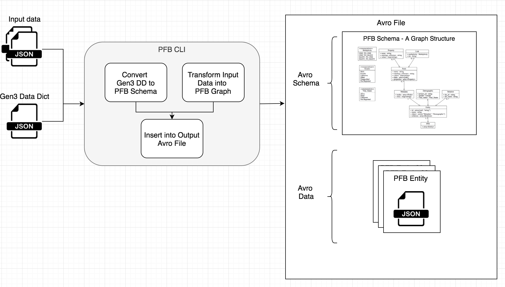

# 💡 Exploration of PFB
Explore [PFB (portable bioinformatics format)](https://github.com/uc-cdis/pypfb)

## Setup for Jupyter Notebook

```shell
$ git clone git@github.com:d3b-center/d3b-lib-pfb-exporter.git
$ cd docs/explore
$ python3 -m venv venv
$ source venv/bin/activate
$ pip install -r requirements.txt
$ jupyter
```

# Background

## What is an Avro File?
A file with data records (JSON) and a schema (JSON) to describe each data
record. Avro files can be serialized into a binary format and compressed.

Read more about [Avro](https://Avro.apache.org/docs/current/spec.html).

## Avro Basics

### Avro File
The writer takes in a schema (JSON file) and the data which conforms to that schema, and writes it to an Avro file. The schema gets written first, then the data.

### Write Avro
The Avro schema is pretty simple. Its a JSON file. It has entities, their attributes, and the types of those attributes. You can represent primitive types and complex types in order to represent the schema for complicated nested JSON structures. Read more about [Avro](https://Avro.apache.org/docs/current/spec.html).

### Read Avro
The reader doesn't need the schema since its embedded in the data. The reader reads in and parses the Avro file to JSON.

## Vanilla Avro vs PFB
Let's say a client receives an Avro file. It reads in the Avro data.
Now a client has the Avro schema and all of the data that conforms to that
schema in a big JSON blob. It can do what it wants. Maybe it wants to construct
some data input forms. It has everything it needs to do this since the schema
has all of the entities, attributes, and types for those attributes defined.

Now what happens if the client wants to reconstruct a relational database
from the data? How does it know what tables to create, and what the
relationships are between those tables? Which relationships are
required vs not? This is one of the problems PFB addresses.

## What is a PFB File?

A PFB file is special kind of Avro file, suitable for capturing and
reconstructing biomedical relational data.

A PFB file is an Avro file with a particular Avro schema that represents a
relational database. We call this schema the
[PFB Schema](https://github.com/uc-cdis/pypfb/tree/master/doc)

The data in a PFB file contains a list of JSON objects called PFB Entity
objects. There are 2 types of PFB Entities. One (Metadata) captures
information about the relational database and the other (Table Row) captures
a row of data from a particular table in the database.

The data records in a PFB file are produced by transforming the original data
from a relational database into PFB Entity objects. Each PFB Entity object
conforms to its Avro schema.

## PFB CLI (pypfb Python package)
1. Convert a Gen3 data dictionary into an avro schema for the PFB file and
   the PFB Metadata PFB Entity
2. Transform the input data into PFB Entities
3. Add the PFB file's Avro schema to the output Avro file
4. Add PFB Entities to the output Avro file




## Comments/Concerns with pypfb

### PFB Concept = Good
A PFB institutes a standard way of efficiently packaging data from a
relational database along with its schema. This seems widely applicable.

### Original Source Data Structure is Wrapped
PFB does NOT try to preserve the original structure of the source data.

Rather, it wraps the source data JSON objects in PFB Entity JSON objects so
that it can preserve the entity definitions and relationships. This means a PFB
file by itself should not be used to migrate data between two instances of the
same system.

Something will need to read a PFB file, and parse out the original JSON objects
from the PFB Entity JSON objects.

### Dependency on Gen3 Data Dictionary
- The conversion from a Gen3 data dictionary to an Avro schema
  seems unnecessary for data that does not come from Gen3.

### Issues with the CLI
- The CLI is seems slow (pfb -h takes 3 seconds, why?)
- Code has large commented sections and is a little difficult to follow. May
  need to be cleaned up and/or refactored.

## Apache Avro
- Don't use this
- Apache's python Avro package is super slow because its written in pure Python
- Also the setup.py is missing pycodestyle dependency pypy Avro package
can't find StringIO module. I think you need the snappy codec package for it to work.

## Fast Avro
- pypfb uses this package
- Written in cpython so its way faster than Apache's Python package
- Doesn't support schema hashing or parsing into canonical form
(needed for diffing two schemas)

## Recommendations

**Implemented in https://github.com/d3b-center/d3b-lib-pfb-exporter**

- Create a PFB CLI which can point to a relational database and
  generate a PFB file
- The tool should inspect the database and directly produce the PFB schema
  (skip the intermediate Gen3 data dictionary layer)
- The tool should transform data from the database into PFB entities
- The tool should have an option to download the data from the database.
  Otherwise, a directory of JSON ND files with payloads representing rows
  from tables in the database should be provided to the tool.
